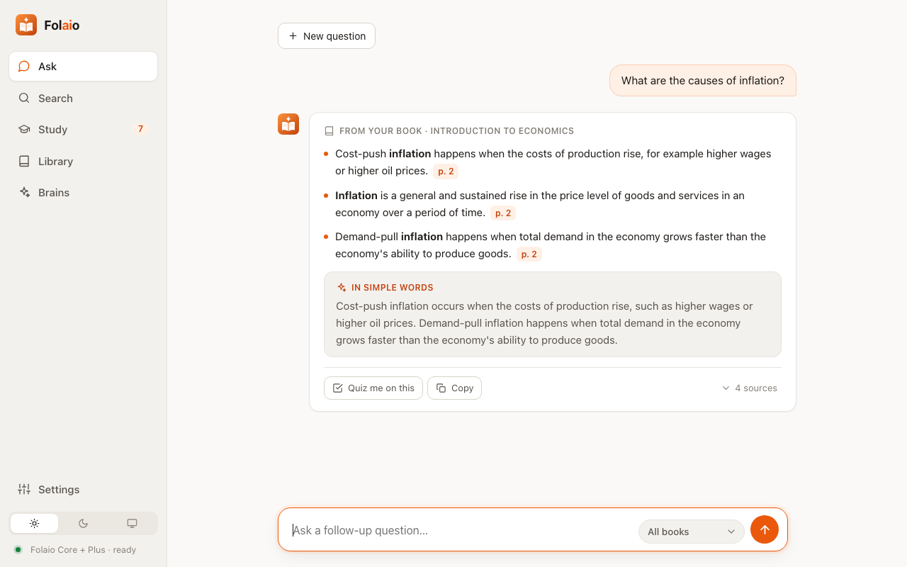
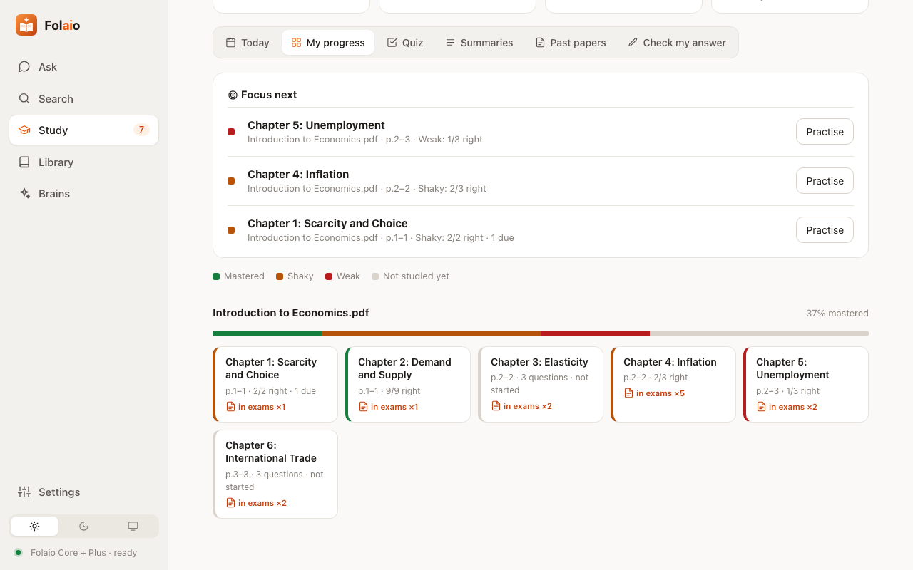
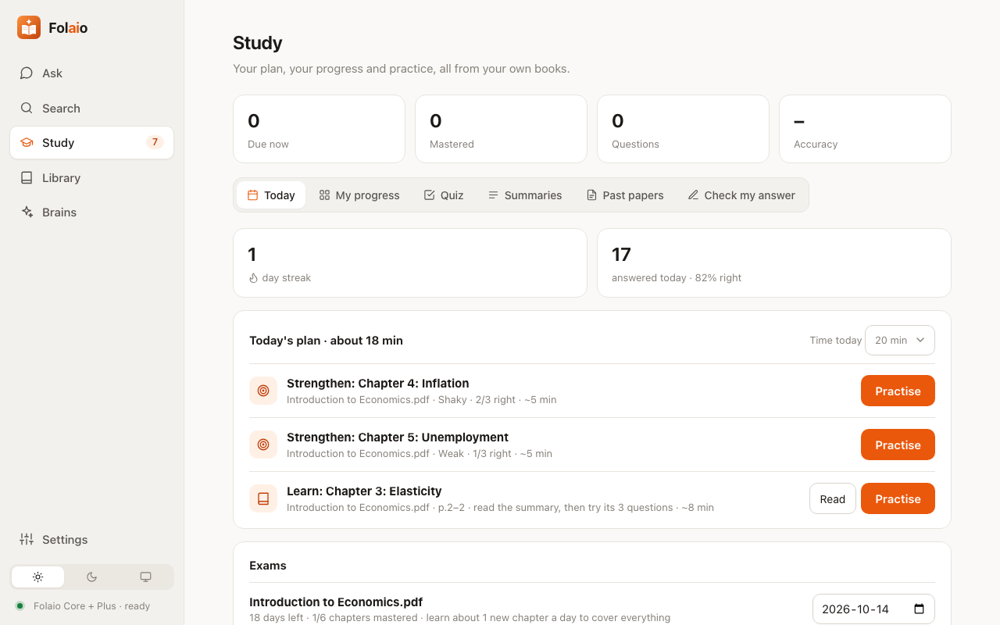
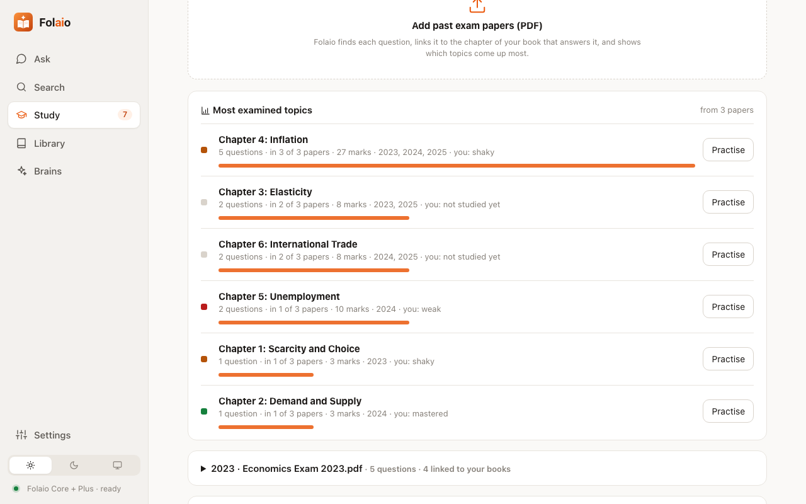
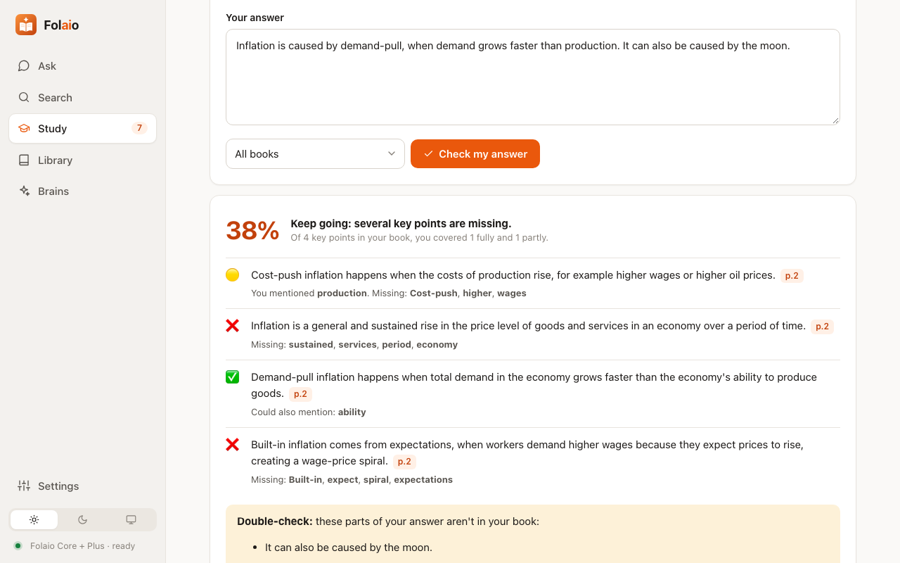
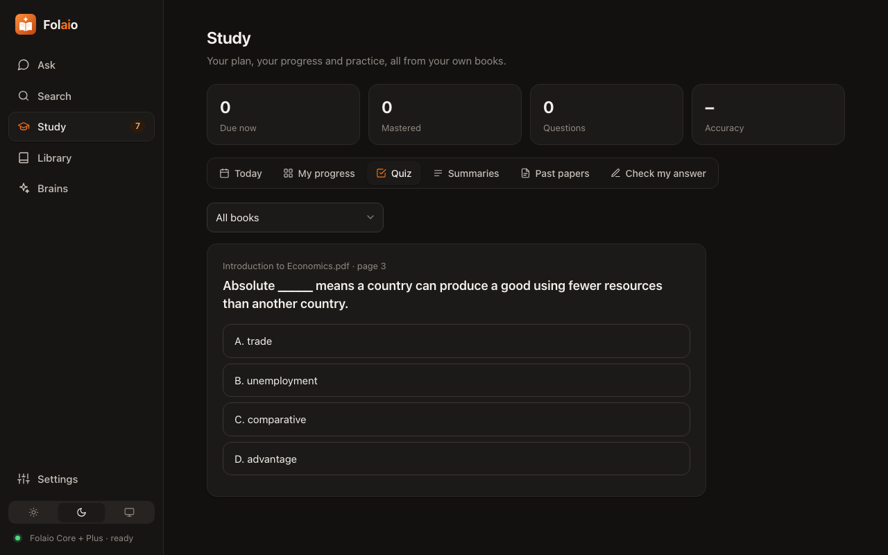

<p align="center"></p>

<h1 align="center">Folaio</h1>

<p align="center">
  <b>Your private AI study coach.</b><br>
  It learns <i>your</i> textbooks, answers from your own pages, and helps you master them for exams.<br>
  100% offline · runs on ordinary laptops · your files never leave your computer.
</p>

<p align="center">
  
  
  
  
</p>

<p align="center">
  <picture>
    <source media="(prefers-color-scheme: dark)" srcset="docs/screenshots/home-dark.png">
    
  </picture>
</p>

---

## Why Folaio?

Most AI chatbots know a little about everything, need the internet, and sometimes make things up.
**Folaio is the opposite.** It knows *your* books deeply, works without the internet, and every answer
comes with the page it came from. Then it helps you actually *learn* them: it remembers what you know,
plans your revision, and tells you which chapters your exams ask about most.

### What makes it different

|  | Typical cloud AI chatbots | **Folaio** |
|---|---|---|
| **Knows your textbook** | Only what you paste in each time | Learns your whole library, once |
| **Makes things up?** | Can invent facts ("hallucinate") | Answers with sentences **from your books**, with **page numbers** |
| **Remembers what you know** | No, every chat starts fresh | **Knowledge Map** and spaced repetition track every chapter |
| **Knows your exams** | No | Reads **past papers** and shows the most examined topics |
| **Internet and account** | Required | **Not needed**: runs on your computer |
| **Your files** | Uploaded to someone's server | **Never leave your computer** |
| **Computer needed** | Any (it runs in the cloud) | Any ordinary laptop, **no GPU** |

Folaio isn't trying to be a general chatbot. It's a **study coach for your own material**, and that's
what it does better.

---

## Features

### 💬 Ask your books: answers you can trust
Ask in plain language. Folaio answers with the **exact sentences from your textbook**, key terms in bold,
and a **page chip** that opens the PDF at that page. If your books don't cover it, it says so instead of guessing.
With an optional tiny *Plus* brain, it also explains the answer **in simple words**.

<p align="center"><picture>
  <source media="(prefers-color-scheme: dark)" srcset="docs/screenshots/answer-dark.png">
  
</picture></p>

### 🗺️ Knowledge Map: see what you really know
Every chapter of every book as a coloured tile: **mastered, shaky, weak, or not studied yet**, based on
your quiz history and spaced repetition. **Focus next** tells you where to spend your time.

<p align="center"></p>

### 📅 A study plan for today, paced for your exam
Set an exam date. Each day Folaio plans the time you have: **review** what's due, **strengthen** weak
chapters, **learn** the next one, paced so you cover everything before the exam. Keep your streak going.

<p align="center"></p>

### 📝 Past-paper analysis: know what the exam asks
Add past exam papers. Folaio splits them into questions, **links each question to the chapter that
answers it**, and shows **which topics come up most**, with marks and years. Your study plan then puts
those chapters first.

<p align="center"></p>

### ✍️ Check my answer
Write an answer in your own words. Folaio compares it with your book: which **key points you covered**,
which you **missed** (and the exact words to use), and any claim your book **doesn't support**.

<p align="center"></p>

### 🎓 Quizzes that are never wrong
Fill-in-the-blank questions made from your book's real sentences, so the answer key can't be wrong.
The wrong choices are related terms, so they make you think. Spaced repetition brings each question back
just before you'd forget it.

<p align="center"></p>

### 📦 Subject Packs: share a whole subject in one file
A teacher (or a classmate) packs the books, past papers, summaries and quizzes into one `.folaio` file.
Share it by USB, email or WhatsApp; it opens offline, ready to study. Personal progress is never included.

### 🌗 And the details
Light and dark themes · summaries of every chapter · search across all your books · a drop-in *inbox* folder ·
everything in one portable folder you can copy to a USB drive.

---

## Who it's for

- **Students** revising for exams from their own textbooks and notes.
- **Teachers** who want to give a class a ready-to-study subject, offline.
- **Anyone with private documents** (law, medicine, HR, research) who can't upload them to the cloud.
- **Schools and homes with old computers or poor internet.**

---

## Install and start

> One-click installers are on the way. Until then, installing takes about 5 minutes and **no typing of code** on Mac and Windows:
> you install Python once, download Folaio, and double-click **Start Folaio**.

Pick your computer:

<details open>
<summary><b>🍎 Mac</b></summary>

1. **Install Python** (skip if you already have it)
   - Go to [python.org/downloads](https://www.python.org/downloads/), click **Download Python**, open the file and follow the installer.

2. **Download Folaio**
   - On this page, click the green **Code** button → **Download ZIP**.
   - Open your **Downloads** folder and double-click the ZIP to unzip it. Move the **Folaio** folder wherever you like
     (for example, *Documents*).

3. **Start Folaio**
   - Open the Folaio folder and double-click **Start Folaio.command**.
   - The **first time**, macOS may say it's from an unidentified developer. **Right-click** the file → **Open** → **Open**.
     You only need to do this once.
   - The first start sets things up (1–2 minutes). Then Folaio **opens in your browser** automatically.

4. **Next time:** just double-click **Start Folaio.command** again. To stop Folaio, close its Terminal window.

</details>

<details>
<summary><b>🪟 Windows</b></summary>

1. **Install Python** (skip if you already have it)
   - Go to [python.org/downloads](https://www.python.org/downloads/), click **Download Python**, and run the installer.
   - ⚠️ On the first screen, **tick "Add python.exe to PATH"**, then click **Install Now**.

2. **Download Folaio**
   - On this page, click the green **Code** button → **Download ZIP**.
   - In your **Downloads** folder, right-click the ZIP → **Extract All…** → **Extract**.

3. **Start Folaio**
   - Open the Folaio folder and double-click **Start Folaio.bat**.
   - If Windows shows *"Windows protected your PC"*, click **More info** → **Run anyway**. You only need to do this once.
   - The first start sets things up (1–2 minutes). Then Folaio **opens in your browser** automatically.

4. **Next time:** just double-click **Start Folaio.bat** again. To stop Folaio, close its black window.

</details>

<details>
<summary><b>🐧 Linux</b></summary>

1. **Install Python and Git** (Ubuntu/Debian; use your distribution's package manager otherwise):
   ```bash
   sudo apt install python3 python3-venv git
   ```
2. **Download and start Folaio:**
   ```bash
   git clone https://github.com/oprone/folaio.git
   cd folaio
   ./start-folaio.sh
   ```
   The first start sets things up (1–2 minutes). Then Folaio opens in your browser.
3. **Next time:** run `./start-folaio.sh` in the Folaio folder. Press **Ctrl+C** to stop.

</details>

**Folaio runs at `http://127.0.0.1:8765`** in your browser, only on your own computer. Drop in a PDF and start asking.

### Optional: Folaio Plus ("In simple words" explanations)

Folaio works fully without this. Plus adds a short, simple explanation under each answer using a tiny AI
brain (0.3–0.4 GB) that runs offline. It needs one extra component, the *engine*:

| Computer | Install the engine (stop Folaio first, then run this in the Folaio folder) |
|---|---|
| **Mac** | Open **Terminal** in the Folaio folder and run: `.venv/bin/pip install -r requirements-plus.txt` (if asked, install the *Command Line Developer Tools*) |
| **Windows** | Open **Command Prompt** in the Folaio folder and run: `.venv\Scripts\pip install llama-cpp-python --extra-index-url https://abetlen.github.io/llama-cpp-python/whl/cpu` |
| **Linux** | `sudo apt install build-essential cmake`, then `.venv/bin/pip install -r requirements-plus.txt` |

Then start Folaio again, open the **Brains** page and download **Mini** or **Small**.

<details>
<summary><b>For developers</b></summary>

```bash
git clone https://github.com/oprone/folaio.git && cd folaio
python3 -m venv .venv && source .venv/bin/activate      # Windows: .venv\Scripts\activate
pip install -r requirements.txt                          # + requirements-plus.txt for Folaio Plus
python run.py
```
Needs Python 3.10+. All data (library, what Folaio learned, brains) lives in `data/`.

</details>

---

## How it works

**In plain words:** Folaio reads your PDFs, learns them with its **own small neural network** on your
computer, and then finds the right sentences whenever you ask. It never invents an answer: it quotes your book.

<details>
<summary><b>Under the hood</b> (for the curious)</summary>

- **Folaio Core** is Folaio's own AI, not a downloaded model. **FolaioNet**, a one-hidden-layer neural
  network written from scratch in NumPy, trains on your library by learning which chapter every sentence
  belongs to (the chapters are the labels, so nobody tags anything). Its hidden layer learns which words
  and ideas belong together.
- **Search** combines keyword ranking (BM25) with what FolaioNet learned. If most of a question's words
  never appear in your library, Folaio says *"I couldn't find this in your documents"* instead of guessing.
- **Quizzes** blank out each chapter's key terms (preferring definitions and headings); wrong choices are
  related terms chosen with the network's learned word vectors.
- **Past papers** are split into questions and linked to chapters by the same search.
- **Folaio Plus** (optional) runs a tiny open model (SmolLM2 360M or Qwen2.5 0.5B, Apache-2.0) through
  an embedded llama.cpp engine. It only sees the sentences Folaio Core chose, so it can only rephrase them.
- **Measured:** on about 6 MB of text (roughly ten textbooks), Folaio Core learned in ~6 seconds on a
  laptop and recognised which book an unseen sentence came from 83% of the time. Searches take milliseconds.

</details>

---

## Privacy

- Folaio runs **entirely on your computer**. Nothing you add is uploaded anywhere.
- No account, no tracking, no analytics.
- The only time it uses the internet is if **you** choose to download a Plus brain.
- Everything lives in one `data/` folder inside Folaio. Delete it and Folaio forgets everything.

---

## FAQ

**Is it free?** Yes. Folaio is open source under the MIT license.

**Does it need a powerful computer?** No. Folaio Core runs on ordinary laptops without a GPU.
The optional Plus brains need about 2–4 GB of RAM.

**What files can I add?** PDFs that contain text (most digital textbooks and notes). Scanned
PDFs need OCR, which is on the roadmap.

**Which languages?** English, for now.

**Can it be wrong?** Folaio's answers are sentences from your own books, so they're only as right as your
books, and it may pick a less relevant sentence now and then. The optional Plus brain can occasionally add
small details, which is why the book's own sentences always come first.

---

## Roadmap

- [x] Folaio Core: its own neural network trained on your PDFs
- [x] Cited answers, summaries, quizzes with spaced repetition
- [x] Knowledge Map, daily plan with exam countdown, answer checker
- [x] Past-paper analysis and Subject Packs
- [x] Light and dark themes
- [ ] One-click installers for macOS and Windows
- [ ] OCR for scanned PDFs and photos of notes
- [ ] Follow-up questions that remember the conversation
- [ ] More languages

Ideas and bug reports are welcome in [Issues](https://github.com/oprone/folaio/issues).

---

## Contributing

Pull requests are welcome. Folaio is plain Python (FastAPI, NumPy, SQLite) with a vanilla HTML/CSS/JS
interface: no build step. Please keep it light: it must stay fast on ordinary laptops.

## Credits

[pypdfium2](https://github.com/pypdfium2-team/pypdfium2) (Apache-2.0/BSD), [NumPy](https://numpy.org) (BSD),
[SQLite](https://sqlite.org) (public domain), [FastAPI](https://fastapi.tiangolo.com) (MIT). For Folaio Plus:
[llama.cpp](https://github.com/ggml-org/llama.cpp) and [llama-cpp-python](https://github.com/abetlen/llama-cpp-python) (MIT),
[SmolLM2](https://huggingface.co/HuggingFaceTB/SmolLM2-360M-Instruct) and [Qwen2.5](https://github.com/QwenLM) models (Apache-2.0).
Inspired by [Cony AI](https://github.com/TechieCony/Text-Classifier).

## License

[MIT](LICENSE) © 2026 Lalith Herath
